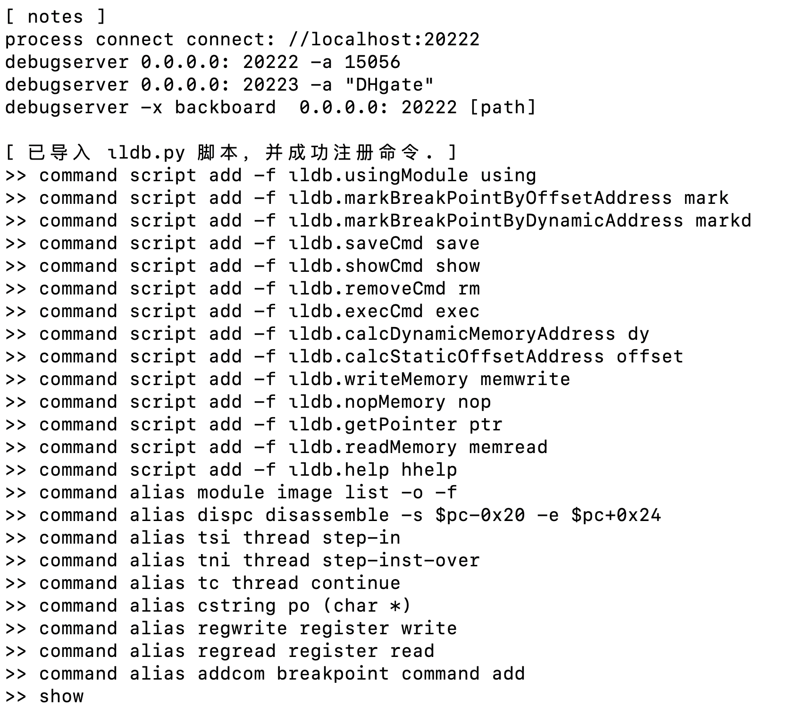
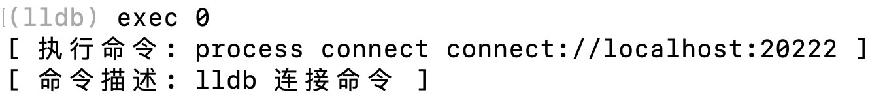
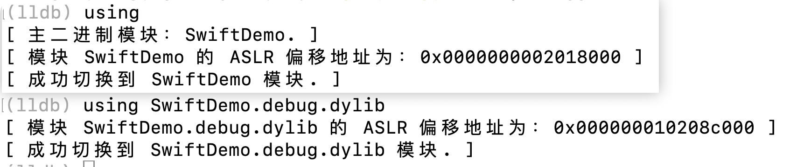
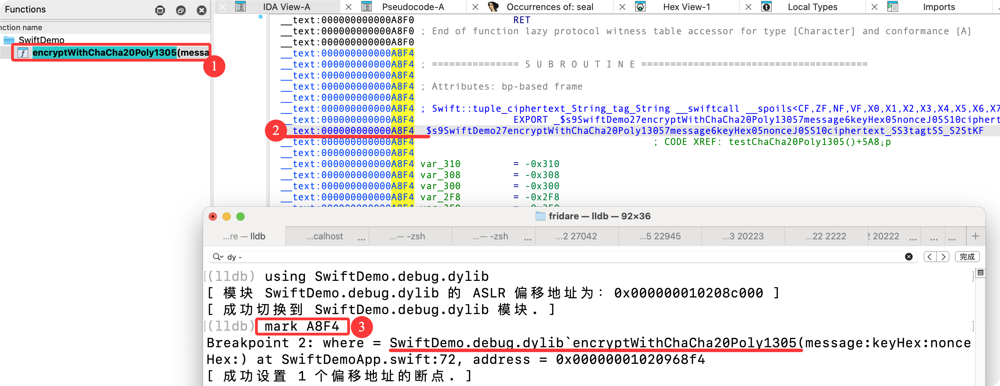
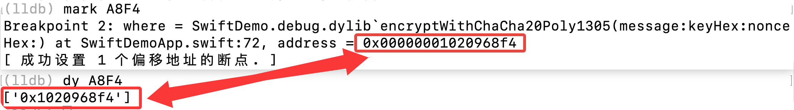
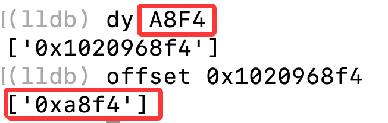
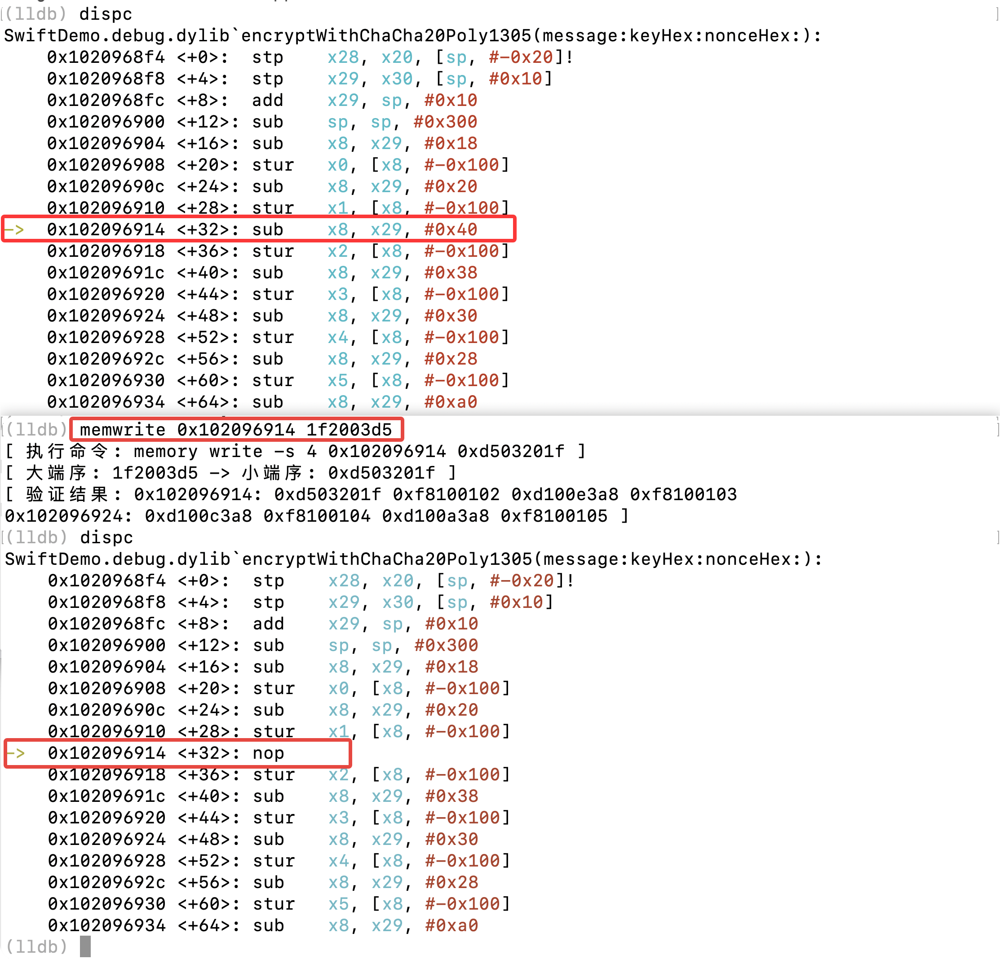
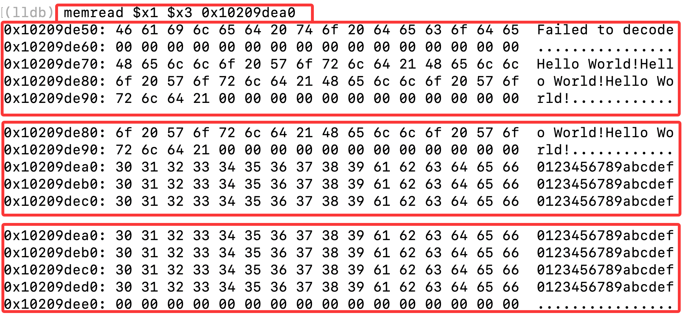
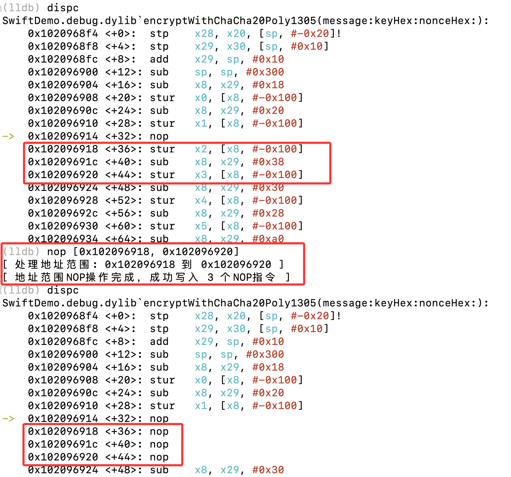
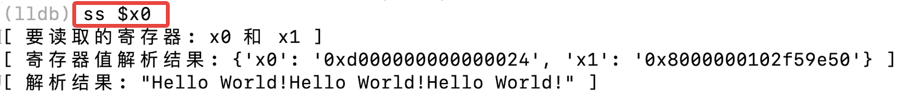

# ιldb 使用文档

## 概述

ιldb（约塔-ldb） 是一个基于 LLDB 的调试脚本工具，提供了多种便捷的调试命令和命令管理功能。它通过模块化设计，将常用的调试操作封装为简单易用的命令，并支持命令的保存、显示、删除和执行。如果这些命令的命名方式与您使用的习惯不符合，也可以通过修改 cmd_config.json 来实现个性化定制。
ιldb 内置命令保存与注释功能，可告别「调试命令 / 地址复制到文本、再从文本粘贴调用」的繁琐流程，实现命令的快速执行与管理。

## 安装与初始化

1. 将 ιldb.py 文件放置在您的 LLDB 插件目录中

2. 在 ~/.lldbinit/ 文件中添加以下命令加载脚本：
   ```
   # ***/ 替换为你自己的路径
   command script import /path/to/ιldb.py
   ```
   
3. 加载成功后，您将看到所有已注册的命令列表

	


## 核心功能

### 1. 命令管理功能

#### save - 保存命令到记录

保存 LLDB 历史命令到 cmd_record.json 文件中，支持多种格式：

```bash
# 保存最近一条命令，描述为空
save

# 保存最近一条命令，并添加描述
save "这是最近一条命令"

# 保存指定序号的历史命令，并添加描述
save 0 "这是 history 中序号为 0 的命令" 2 "这是 history 命令中序号为 2 的命令"

# 混合格式：保存多个命令，只有部分带描述
save 0 2 "这是命令"
```

#### show - 显示命令列表

显示已保存的所有命令及其描述：

```bash
show
```

输出示例：
```
[ 命令列表 ]
0. using       —— 指定模块（后续mark命令基于该模块）
1. mark        —— 基于模块偏移地址打断点（支持多地址）
2. markd       —— 基于动态地址打断点（支持多地址）
3. memread     —— 读取内存内容
4. process     —— 启动进程
```

#### rm - 删除命令记录

根据序号删除已保存的命令：

```bash
# 删除单个命令
rm 1

# 删除多个命令
rm 0 2 4
```

删除后会自动显示更新后的命令列表。

#### exec - 执行命令记录

根据序号执行已保存的命令：

```bash
# 执行序号为1的命令
exec 1
```

执行时会显示命令内容及其描述。




### 2. 调试功能

#### using - 指定调试模块

指定当前调试的模块，后续的 mark 命令将基于该模块计算偏移地址：

```bash
# 使用应用程序的主模块
using

# 使用指定的模块
using SwiftDemo.debug.dylib
```




#### mark - 基于模块偏移地址打断点

基于指定模块的偏移地址设置断点，支持多地址：

```bash
# 单个地址
mark 0x1063c2c10

# 多个地址
mark 0x1063c2c10 1063c2c18 0x1063c2c20

# 地址范围（地址必须以0x开头）
mark [0x1063c2c10, 0x1063c2c20]
```

IDA 中  `encryptWithChaCha20Poly1305` 函数的偏移地址是 `A8F4`，那么可以使用 `mark` 快速打上断点




#### markd - 基于动态地址打断点

基于动态地址设置断点，支持多地址：

```bash
# 单个地址
markd 0x12345678

# 多个地址
markd 0x12345678 0x87654321
```


#### dy - 计算动态内存地址

基于 using 指定的模块 来计算偏移的动态内存地址：

```bash
dy 0xA8F4
```




#### offset - 计算静态偏移地址

基于当前模块计算静态偏移地址：

```bash
# 计算指定地址的偏移
offset 0x1063c2c10

# 计算当前 PC 寄存器的偏移
offset
```




#### memwrite - 内存修改

对指定地址进行内存修改，默认会执行端序转换：

```bash
# memwrite 后面的这个地址是动态内存地址，不是偏移地址
memwrite 0x1063c2c10 1f2003d5
```

注意：地址和机器码不一定要以 0x 开头，默认是十六进制。




#### memread - 内存读取

读取内存内容，支持多种格式：

```bash
# 读取多个地址
memread $x8 0x12345678

# 先从指定地址获取指针，再读取该指针指向的内存
memread -ptr ($x8 + 0x20)

# 指定读取字节数
memread -c 0x100 $x8
memread --count 0x200 0x12345678
```




#### nop - 内存填充NOP指令

将指定地址的内存填充为 NOP 指令：

```bash
# 单个地址
nop 0x1063c2c10

# 多个地址
nop 0x1063c2c10 1063c2c18 0x1063c2c20

# 地址范围（地址必须以0x开头）
nop [0x1063c2c10, 0x1063c2c20]
```




#### ptr - 获取指针地址

获取地址中的指针地址：

```bash
# 获取寄存器表达式的指针地址
ptr ($x8 + 0x8) ($x8 + 0x20)

# 获取直接地址的指针
ptr 0x12345678
```


#### ss - 尝试解析为 Swift String 字符串

尝试将寄存器中的内容解析为 Swift String 字符串，只需要指定一个寄存器，另外一个寄存器内部会自动取读取




#### sd - 尝试解析为 Swift Data 字符串


## 配置文件

ιldb 使用两个主要的配置文件：

### cmd_config.json

存储命令配置信息，包括：
- cmd_script: 命令脚本映射

- cmd_alias: 命令别名映射

- cus_cmd: 自定义命令列表
	- 这部分命令会在脚本加载之处自动执行

- cmd_notes: 命令注释列表
	- 这部分命令会打印在终端，但不会执行，主要是一个备忘的作用


### cmd_record.json

存储用户保存的命令记录，每个记录包含：
- command: 实际执行的 LLDB 命令
- desc: 命令描述


## 命令脚本映射

为了提高使用效率，ιldb 提供了以下命令映射：

| 命令名 | 函数名 | 描述 |
|------|--------|------|
| using | usingModule | 指定调试模块 |
| mark | markBreakPointByOffsetAddress | 基于模块偏移地址打断点 |
| markd | markBreakPointByDynamicAddress | 基于动态地址打断点 |
| dy | calcDynamicMemoryAddress | 计算动态内存地址 |
| offset | calcStaticOffsetAddress | 计算静态偏移地址 |
| memread | readMemory | 读取内存 |
| memwrite | writeMemory | 写入内存 |
| nop | nopMemory | 填充NOP指令 |
| ptr | getPointer | 获取指针地址 |
| save | saveCmd | 保存命令 |
| show | showCmd | 显示命令列表 |
| rm | removeCmd | 删除命令 |
| exec | execCmd | 执行命令 |
| ss | parseSwiftString | 尝试解析为 Swift 字符串对象 |
| sd | parseSwiftData | 尝试解析为 Swift Data对象 |


## 使用示例

### 完整调试流程示例

```bash
# 1. 指定调试模块
using SwiftDemo.debug.dylib

# 2. 设置断点
mark 0x1063c2c10
markd 0x12345678

# 3. 保存常用命令
save "指定调试模块"
history
save 0 "在入口函数设置断点" 1 "在关键函数设置断点"

# 4. 查看保存的命令
show

# 5. 执行保存的命令
exec 0
exec 1

# 6. 读取内存
memread $x8

# 7. 修改内存
memwrite 0x1063c2c10 d503201f

# 8. 填充NOP指令
nop [0x1063c2c10, 0x1063c2c20]
```


## 注意事项

1. 所有序号（save、show、rm、exec）都是从 0 开始的
2. 地址范围格式（如 [0x1063c2c10, 0x1063c2c20]）中的地址必须以 0x 开头
3. 单个地址和多个地址格式不要求地址以 0x 开头
4. 内存操作默认使用十六进制
5. 命令历史记录保存在 `ιldb/config/cmd_record.json` 文件中


## 扩展功能

**ιldb 支持通过修改 cmd_config.json 文件添加自定义命令和别名，实现个性化定制。**


# 补充

【 2025年12月20号 】

1、修复 ptr 命令 和 memread -ptr 命令的相关问题；

2、新增 ss 和 sd 命令，可以用于解析 Swift String 对象和 Data 对象。

